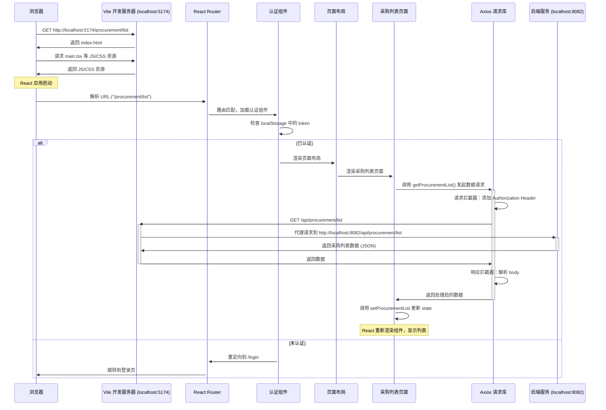

# 前端页面请求流程分析：/procurement/list

本文档将详细阐述当用户在浏览器中访问 `http://localhost:5174/procurement/list` 时，前端工程内部所发生的一系列处理流程。

## 整体流程图



## 详细步骤分解

1.  **用户请求与入口文件**
    -   用户在浏览器输入 `http://localhost:5174/procurement/list`。
    -   Vite 开发服务器接收到请求，返回项目的入口 HTML 文件 `index.html`。
    -   浏览器解析 `index.html`，并根据其中的 `<script>` 标签加载 JavaScript入口文件 [src/main.tsx](file:///e:/Git/procurement-system-new/src/main.tsx)。
    -   `main.tsx` 负责渲染整个 React 应用的核心组件 [src/App.tsx](file:///e:/Git/procurement-system-new/src/App.tsx)。

2.  **路由匹配**
    -   [src/App.tsx](file:///e:/Git/procurement-system-new/src/App.tsx) 内部使用了 `react-router-dom` 的 `<BrowserRouter>` 来管理应用的路由。
    -   URL 路径 `/procurement/list` 与以下路由规则匹配：

        ```tsx
        <Route path="procurement/list" element={<ProcurementList />} />
        ```

3.  **认证与布局**
    -   该路由被包裹在一个父路由中，该父路由首先通过 [src/components/layout/RequireAuth.tsx](file:///e:/Git/procurement-system-new/src/components/layout/RequireAuth.tsx) 组件进行认证检查。`RequireAuth` 通常会检查 `localStorage` 或其他状态管理库中是否存在有效的用户凭证（如 token）。
    -   如果用户已通过认证，则渲染 [src/components/layout/MainLayout.tsx](file:///e:/Git/procurement-system-new/src/components/layout/MainLayout.tsx) 组件。`MainLayout` 定义了网站的通用布局，如顶部导航栏和侧边栏。
    -   `MainLayout` 组件内部会有一个 `<Outlet />` 组件，它作为子路由（即我们的 `ProcurementList` 页面）的渲染占位符。

4.  **页面组件渲染**
    -   路由匹配成功后，React 会将 [src/pages/ProcurementList.tsx](file:///e:/Git/procurement-system-new/src/pages/ProcurementList.tsx) 组件渲染到 `MainLayout` 的 `<Outlet />` 中。

5.  **数据获取**
    -   在 `ProcurementList` 组件内部，`useEffect` Hook 会在组件首次加载时触发数据获取逻辑。
    -   `fetchData` 函数被调用，它通过 `Promise.all` 并发请求两个接口：
        -   `getProcurementList()`: 获取采购列表数据。
        -   `getProcurementStats()`: 获取统计数据。
    -   这些API函数定义在 [src/api/procurement.ts](file:///e:/Git/procurement-system-new/src/api/procurement.ts) 文件中。

6.  **HTTP 请求与代理**
    -   `getProcurementList` 函数使用了一个全局配置的 Axios 实例（名为 `request`）来发起 GET 请求到 `/api/procurement/list`。
    -   这个 Axios 实例定义在 [src/utils/request.ts](file:///e:/Git/procurement-system-new/src/utils/request.ts) 中，它包含两个重要的拦截器：
        -   **请求拦截器**: 在请求发送前，自动从 `localStorage` 读取 token，并将其添加到 `Authorization` 请求头中。
        -   **响应拦截器**: 在收到响应后，检查后端返回的 `returnCode`。如果为 `SUC0000`，则直接返回 `body` 字段中的数据，简化了组件中的数据处理逻辑。
    -   根据 [vite.config.ts](file:///e:/Git/procurement-system-new/vite.config.ts) 的配置，所有以 `/api` 开头的请求都会被 Vite 开发服务器代理到后端服务地址 `http://localhost:8082`。

7.  **状态更新与UI渲染**
    -   当后端成功返回数据后，`fetchData` 函数中的 `.then()` 或 `await` 会接收到由响应拦截器处理过的干净数据。
    -   组件通过 `setProcurementList(data)` 和 `setStats(statsData)` 更新其内部的 state。
    -   React 检测到 state 变化，会自动重新渲染 `ProcurementList` 组件。
    -   组件的 JSX 部分会遍历 `procurementList` 数组，将每一条采购数据渲染成页面上的一个卡片或列表项。

这个流程完整地展示了从用户的一个简单点击到最终看到数据呈现在页面上的全过程，涉及到了前端工程化的多个方面，包括路由、状态管理、组件化、HTTP通信和开发服务器代理。